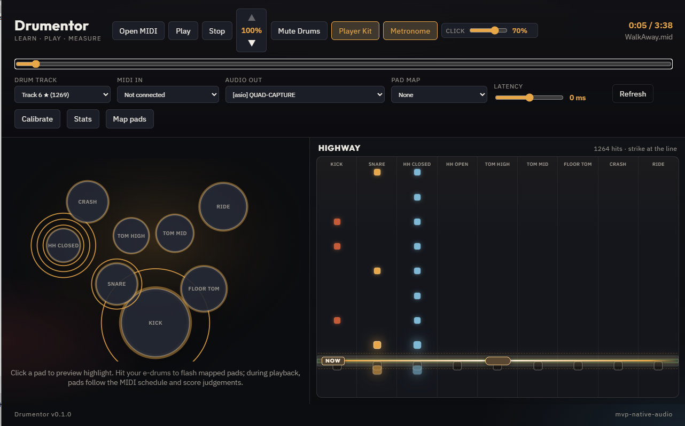

# Drumentor

Drumentor is a desktop application for learning drum parts from MIDI files. It visualizes the part on a virtual drum kit and note highway, receives input from an electronic MIDI drum kit, and evaluates performance accuracy.

Load a MIDI file → see what to hit → play it on your kit → get a score.

## Features

- Load MIDI files and play compositions through a GM SoundFont
- Automatic or manual drum track detection
- Practice screen with a virtual drum kit on the left and a note highway on the right
- Drum kit elements light up when struck
- Adjustable hit line on the note highway
- MIDI e-drum connectivity, pad mapping, and profile storage
- Hit evaluation (timing and accuracy) with session results
- Audio device selection (WASAPI; optional ASIO)
- Drum muting and latency calibration

## Requirements

- Windows 10/11
- [WebView2](https://developer.microsoft.com/microsoft-edge/webview2/) (usually preinstalled)
- A MIDI electronic drum kit (optional for listening along, required for scoring)

## Usage

1. Open a `.mid` or `.midi` file.
2. Confirm or select the drum track.
3. Connect your MIDI drum kit and complete the pad mapping wizard if needed.
4. Press Play and follow the drum kit highlights and note highway.
5. Play along with the hit line; review your score when the session ends.

Sample MIDI file: `testdata/snare_quarters.mid`.

## Status

The project is under active development (MVP). The core practice loop is already functional: MIDI → kit + highway → e-drums → score.

## For developers

Build from source, tech stack, SoundFont setup, and optional ASIO: see [docs/DEVELOPMENT.md](docs/DEVELOPMENT.md). Architecture and domain docs: [docs/README.md](docs/README.md).

