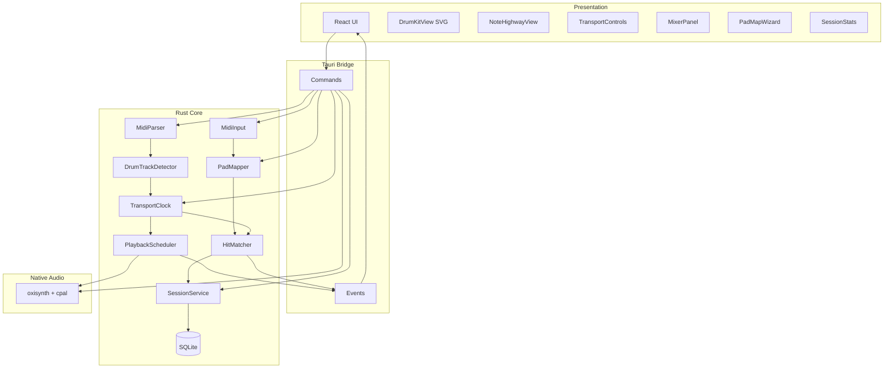
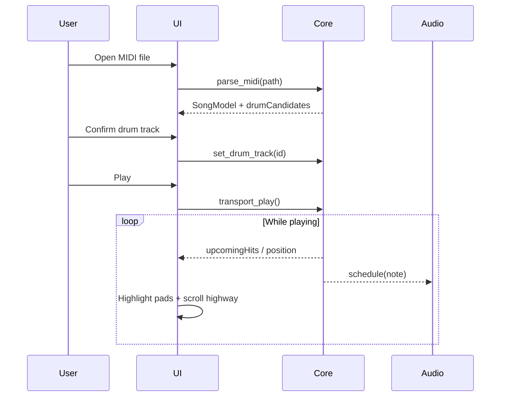
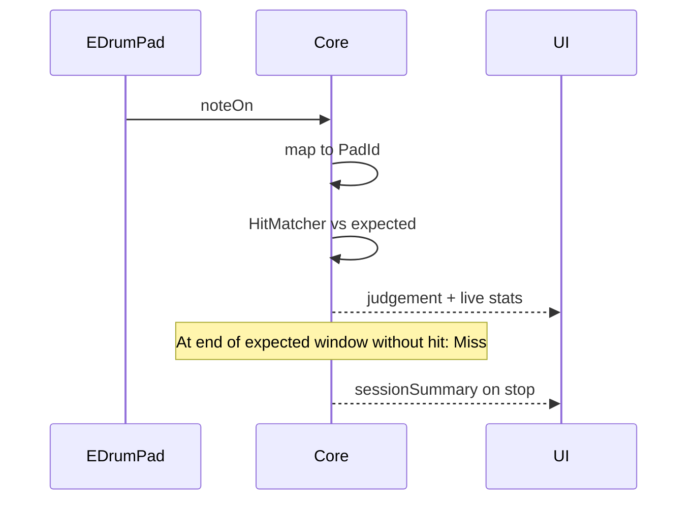
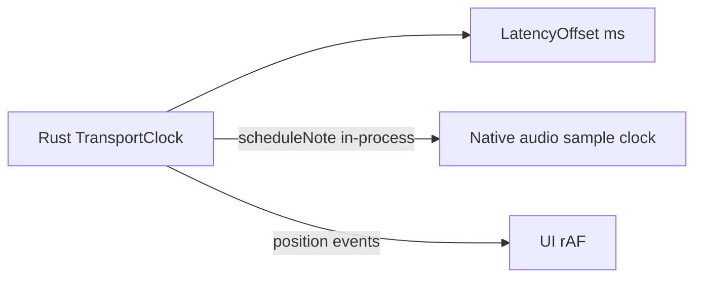

# Architecture — Drumentor

Desktop application architecture. Domain: [DOMAIN.md](DOMAIN.md).

## Architecture goals

1. **Master clock in Rust** — a single source of time for playback, highlighting, and scoring.
2. **Low-latency MIDI in** — path `device → midir → matcher` without extra hops through the UI.
3. **UI as a state projection** — React renders kit / highway / transport / score; it does not own truth for hit matching.
4. **Locality** — MIDI file + SQLite; network is not required until v2.

## Layers



## Core components

### MidiParser

- Input: `.mid` / `.midi` bytes.
- Output: `SongModel` — tracks, tempo map, time signatures, duration.
- Errors: Result → UI toast / dialog.

### DrumTrackDetector

- Candidates + confidence score (see DOMAIN).
- UI confirms `drumTrackId`; the value goes into `SongSessionConfig`.

### TransportClock

- State: `stopped | playing | paused`.
- Fields: `originInstant`, `positionMs`, `speed` (v1), `loopRegion` (v1).
- API: play, pause, stop, seek.
- Ticks and emits:
  - `position` (for UI scrubber, throttle ~30–60 Hz),
  - `upcomingHits` (lookahead window for kit highlighting, note highway, and audio schedule).

### PlaybackScheduler

- Takes note events from non-muted / solo-audible tracks (mixer state in the audio engine).
- For UI: `highlight { padId, atMs, velocity }` event with 50–100 ms lead time (kit), and the same `upcomingHits` stream for the highway (UI interpolates Y from `atMs` relative to the hit-line).
- For audio: in-process `audio.schedule(ScheduleNote)` → oxisynth noteOn/Off on the sample timeline (WASAPI/ASIO); velocity scaled by track gain; master gain applied post-mix.

### Mixer

- Owned by the native audio engine; React `MixerPanel` projects state and sends commands.
- Per song track: volume, mute, solo (any solo → only soloed tracks audible).
- Master / Click / Player Kit volumes; Click and Player sit outside song solo groups.
- `Mute Drums` mutes the selected drum `track_id` (same as that strip’s M).
- Track mixer resets on new MIDI file; preserved when only changing drum track.

### MidiInput + PadMapper

- `MidiInput` reads raw noteOn (channel, note, velocity, host time).
- Host time is converted to session time via clock + latency offset.
- `PadMapper` maps `(note, channel?) → PadId` using the active profile.
- Unmapped notes are ignored or logged as `unmapped` (they do not penalize score).

### HitMatcher

- Buffer of expected drum-track hits in a window around `now`.
- On incoming `PadId`: picks the nearest unmatched expected hit with the same `PadId` within the max window (OK window).
- Writes a `Judgement`, marks expected as matched / on timer — Miss.
- Wrong pad: there is a hit, but no expected hit for that PadId in the window (and/or the nearest expected is another pad) — see SCORING.

### SessionService + SQLite

- Start/stop practice session, bound to song hash + drum track.
- Aggregates in `sessions`; hit details — as needed.
- Load pad map profiles.

## Data flows

### A. Load & Learn (no MIDI in)



### B. Practice (with MIDI in)



### C. Pad mapping wizard

1. UI shows the target `PadId` (“Hit Kick”).
2. The next noteOn from the device is recorded as a binding.
3. Conflicts (two PadIds → one note) — warning, overwrite.
4. Save profile → SQLite.

## Clock sync



Invariants:

1. **Rust clock is master** for session position and scoring timestamps.
2. Native audio engine maps session ms → sample time via `arm` (origin) + speed; lookahead from the ticker.
3. UI highlighting and highway may use lookahead for smoothness; scoring uses the actual session time of the hit.
4. `latencyOffsetMs` (v1 calibration) is added to incoming MIDI time — sign and wizard are fixed in the implementation and in SCORING/settings. Calibration click train goes through the same native sink.
5. **`hitLineY` (UI preference)** affects only highway geometry (approach length). Do not mix with `latencyOffsetMs`: shifting the hit-line does not change expected `timeMs` and does not “fix” latency.

## Responsibility boundaries

| Question | Where it is decided |
|----------|---------------------|
| When to play a backing note | Core schedule → native audio engine |
| Which pad to highlight | Core upcomingHits → UI |
| Where to draw a note on the highway | UI: lane = `PadId`, Y from `(atMs − now)` + hit-line |
| Did the player hit | HitMatcher (Rust) |
| How the kit looks | React SVG (left column) |
| How the highway looks | React Canvas/SVG (right column) |
| Hit-line height | Settings / UI pref (`hitLineY`) |
| Which MIDI note = Snare | PadMapper + SQLite |
| Which track = drums | Detector + user confirm |
| Which audio device | `cpal` list/set + SQLite `audio_device_id` |
| Track mute / solo / gain | Audio engine mixer (`track_id` on `ScheduleNote`) |
| Master / click / player gain | Audio engine mixer |

## Expected repository layout (future scaffold)

```text
drumentor-app/
  apps/desktop/          # or root src-tauri + src
    src/                 # React
    src-tauri/           # Rust
  docs/                  # this documentation
```

Exact monorepo layout is chosen at scaffold time; documentation does not depend on it.

## v1/v2 extensions (without breaking the core)

- **Loop / speed** — TransportClock parameters; expected timeline is recomputed or scaled.
- **Cloud sync** — SessionService gets a remote adapter; local SQLite remains the offline source.
- **Custom kits** — KitView reads layout JSON; PadId enum is extended carefully (versioned schema).
- **ASIO** — Cargo feature `asio` + Steinberg SDK; device picker already supports host `asio`.

## Security and privacy

- FS access — via Tauri dialog / scoped paths.
- MIDI devices — local only; raw stream is not sent outside.
- v2 auth — tokens in OS secure storage; user MIDI files are not uploaded to the cloud without an explicit publish to the library.
